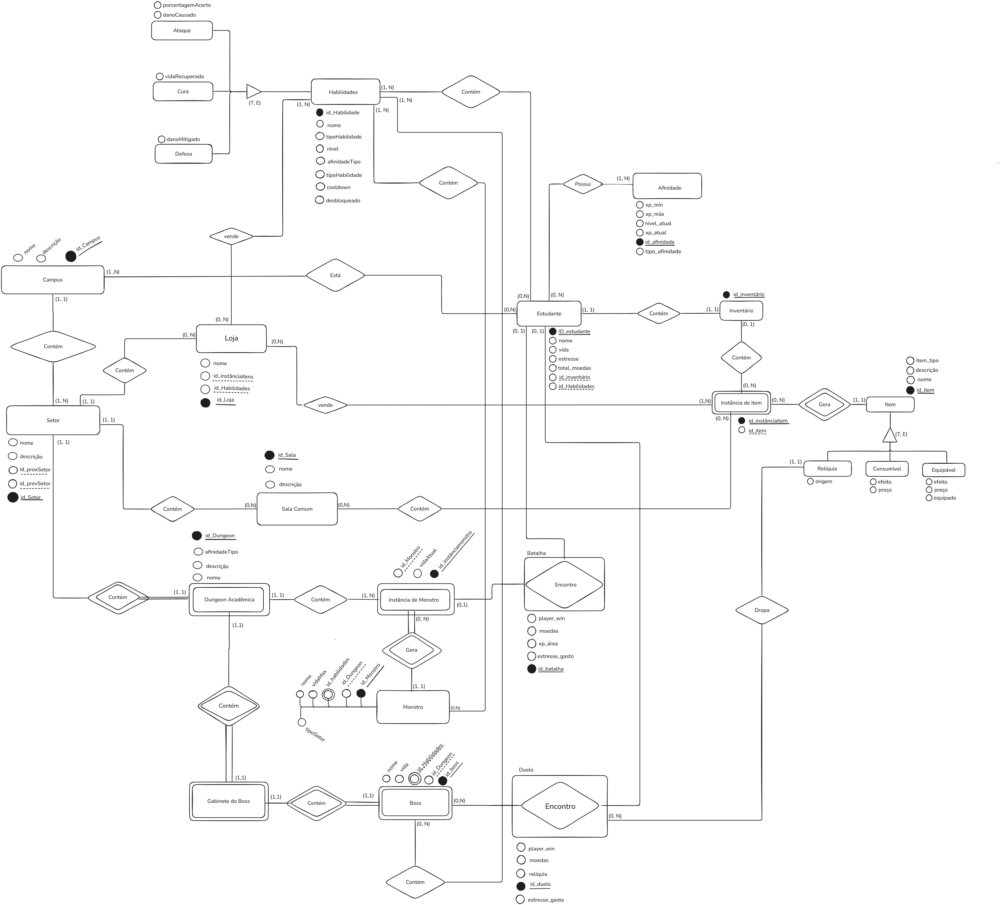
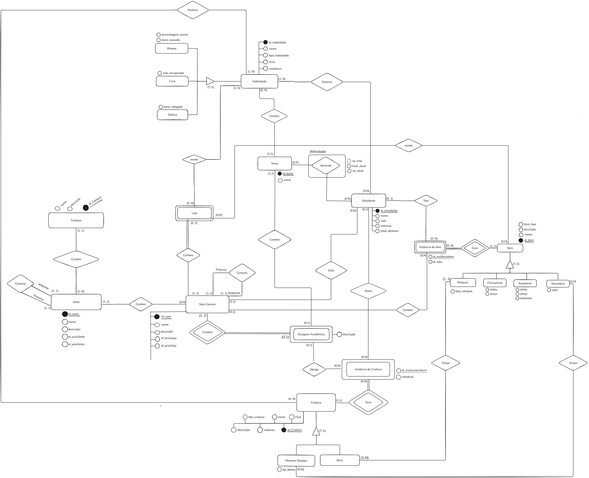

# Diagrama Entidade-Relacionamento

O diagrama de entidade e relacionamento (DER ou ERD) é uma representação visual de como as entidades e seus relacionamentos se organizam em um sistema, como um banco de dados. Serve para modelar dados, mostrando como diferentes elementos (pessoas, objetos, conceitos) se interligam. A seguir é possível observar a visão lógica do banco de dados, fornecendo um conceito mais generalizado de como estão estruturados os dados de um sistema.

---

# V1

---

# V2

 

---

# V3

 

---

# V4

 

---
# V5

 

---

| Versão |  Data  | Descrição| Autor                 |
| :----: | :--------: | ---------------------------------- | -------------------------------------------------------------------------------- |
| `1.0` | 29/04/2025 | Criação do documento DER      | [Isaque Camargos](https://github.com/isaqzin)|
| `1.1` | 29/04/2025 | Criação da primeira versão | [Rafael Schadt](https://github.com/rafaelschadt)|
| `1.2` | 29/04/2025 | Criação da segunta versão      |    TODOS  |
| `1.3` | 29/04/2025 | Criação da terceira versão      |    [Rafael Schadt](https://github.com/rafaelschadt) e [Othavio Bolzan](https://github.com/bolzanMGB)|
| `1.4` | 29/04/2025 | Criação da quarta versão      |    [Rafael Schadt](https://github.com/rafaelschadt) e [Ludmila Aysha](https://github.com/ludmilaaysha) e [Isaque Camargos](https://github.com/isaqzin)|
| `1.5` | 29/04/2025 | Criação da quinta versão, após revisão de todos      |  [Isaque Camargos](https://github.com/isaqzin)|
