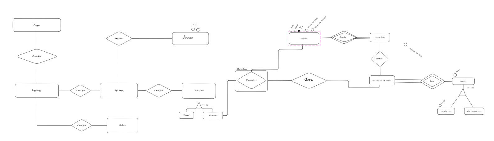

# Diagrama Entidade-Relacionamento

MER, ou Modelo Entidade-Relacionamento, é uma representação gráfica usada para projetar e estruturar bancos de dados de forma lógica. Ele descreve os elementos principais de um sistema, como entidades (objetos ou conceitos), seus atributos (características) e os relacionamentos entre essas entidades. O MER é fundamental na etapa de modelagem de dados, pois ajuda a entender e organizar as informações antes de implementá-las em um banco de dados relacional.

---

# V1

---

# V2

 

---

# V3

 

---

| Versão |  Data  | Descrição| Autor                 |
| :----: | :--------: | ---------------------------------- | -------------------------------------------------------------------------------- |
| `1.0` | 29/04/2025 | Criação do documento DER      | [Isaque Camargos](https://github.com/isaqzin)|
| `1.1` | 29/04/2025 | Criação da primeira versão | [Rafael welz](https://github.com/rafaelschadt)|
| `1.1` | 29/04/2025 | Criação da segunta versão      |    TODOS  |
| `1.2` | 29/04/2025 | Criação da terceira versão      |    [Rafael welz](https://github.com/rafaelschadt) e [Othavio Bolzan](https://github.com/bolzanMGB)|
