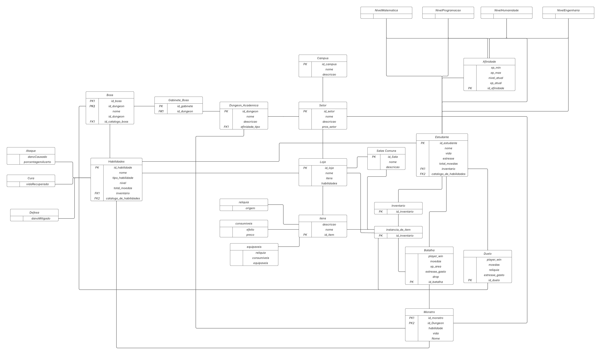
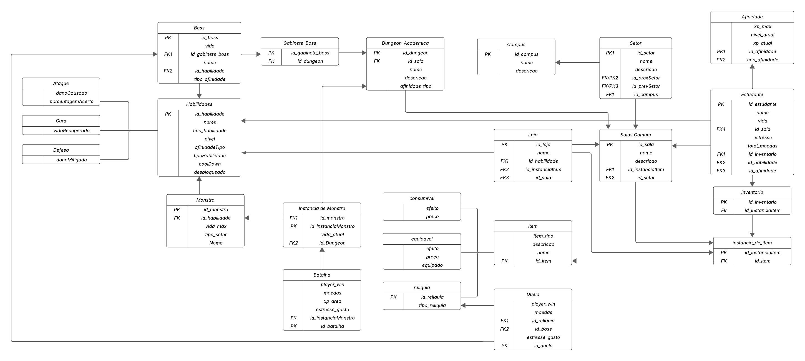
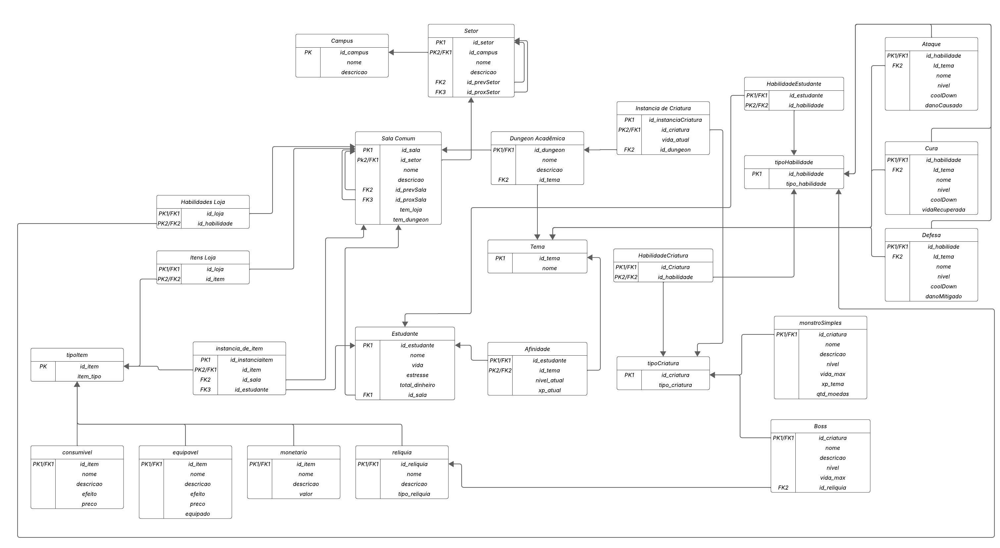
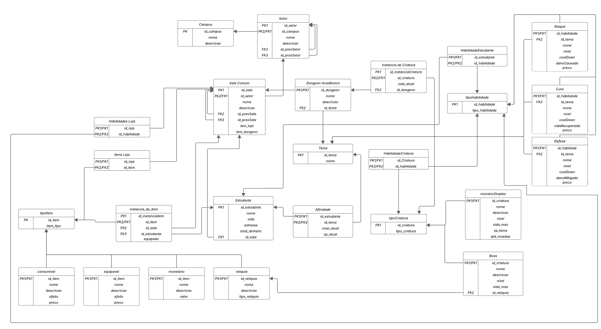

# Modelo Relacional

O Modelo Relacional (MREL) representa logicamente como as entidades e seus relacionamentos serão estruturados no banco de dados. Esse modelo é independente de qualquer Sistema de Gerenciamento de Banco de Dados (SGBD), ou seja, não está vinculado a uma tecnologia específica.

---

## Entrega 1

### V1

---

### V2

---

### V3

---

## Atualizações da Entrega 2

### V4

---

### V5

---
## Atualizações da Entrega 3

### V6

| Versão |  Data  | Descrição| Autor                 |
| :----: | :--------: | ---------------------------------- | -------------------------------------------------------------------------------- |
| `1.0` | 01/05/2025 | Criação do documento MR      | [Rodrigo Amaral](https://github.com/rodrigoFAmaral) & [Milena Marques](https://github.com/milenamso)|
| `1.1` | 02/05/2025 | Adicionando v2 do MR      | [Rodrigo Amaral](https://github.com/rodrigoFAmaral) & [Milena Marques](https://github.com/milenamso)|
| `1.2` | 02/05/2025 | Adicionando v3 do MR      | [Rodrigo Amaral](https://github.com/rodrigoFAmaral) & [Milena Marques](https://github.com/milenamso)|
| `1.3` | 11/06/2025 | Adicionando v4 do MR      | [Isaque Camargos](https://github.com/isaqzin), [Rafael Welz](https://github.com/RafaelSchadt) & [Ludmila Nunes](https://github.com/ludmilaaysha)|
| `1.4` | 04/07/2025 | Adicionando v5 do MR      | [Ludmila Nunes](https://github.com/ludmilaaysha)|