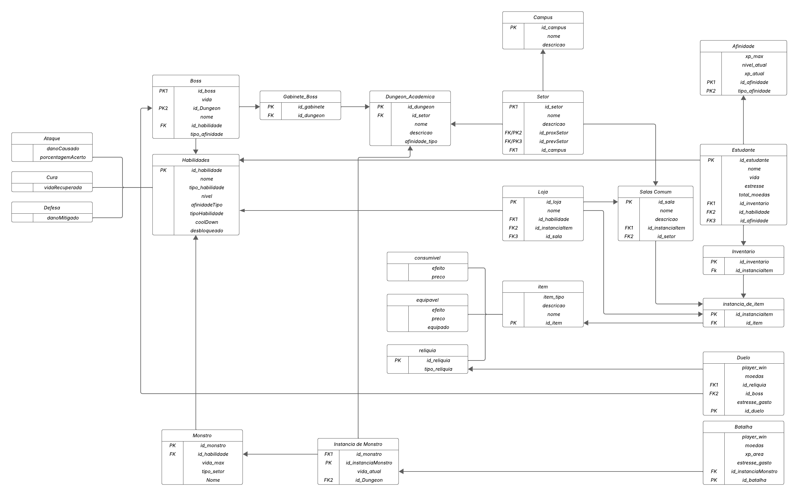

# Modelo Relacional

O Modelo Relacional (MREL) representa logicamente como as entidades e seus relacionamentos serão estruturados no banco de dados. Esse modelo é independente de qualquer Sistema de Gerenciamento de Banco de Dados (SGBD), ou seja, não está vinculado a uma tecnologia específica.

---

# V1

---

# V2

---

# V3

| Versão |  Data  | Descrição| Autor                 |
| :----: | :--------: | ---------------------------------- | -------------------------------------------------------------------------------- |
| `1.0` | 01/05/2025 | Criação do documento MR      | [Rodrigo Amaral](https://github.com/rodrigoFAmaral) & [Milena Marques](https://github.com/milenamso)|
| `1.1` | 02/05/2025 | Adicionando v2 do MR      | [Rodrigo Amaral](https://github.com/rodrigoFAmaral) & [Milena Marques](https://github.com/milenamso)|
| `1.2` | 02/05/2025 | Adicionando v3 do MR      | [Rodrigo Amaral](https://github.com/rodrigoFAmaral) & [Milena Marques](https://github.com/milenamso)|